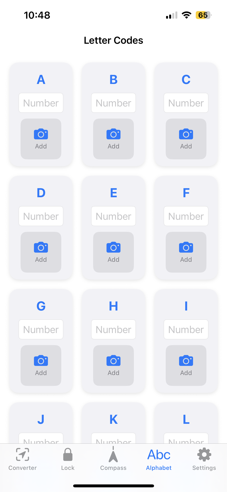

Geocatching Converter is an app for collecting letter codes and calculating the final coordinates in geocaching trail caches.

- Enter letter codes from trail stages.
- Automatic conversion of letters to numbers based on your selected alphabet.
- Calculate azimuth and distance to next points.
- Add notes and letter photos for easier solving.
- Share your results and export coordinates directly to maps.
- Supports various coordinate formats.
- Save current trail settings in isolated snapshots

    
    

    
    

